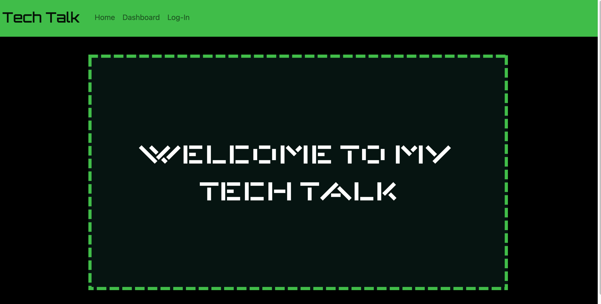

# react-portfolio

[Deployed Site](https://rocky-depths-34530-478c76eea61a.herokuapp.com/)

## Description
CMS-style tech blog built with MySql using MVC design for tech-connoisseurs to congregate and share their thoughts.  This blog allows you to create an account, make posts, comment, and delete posts while logged in.  Visitors can view posts, but must make an account to do anything else.

## Table of Contents

1. [Installation](#installation)
2. [Usage](#usage)
3. [Credits](#credits)
4. [How to Contribute](#how-to-contribute)
5. [Questions](#questions)

## Installation
This application can be cloned at the [github repo](https://github.com/crissyg923/mysql-tech-blog).

## Usage
Head to the [deployed site](https://rocky-depths-34530-478c76eea61a.herokuapp.com/) and create an account or download the [github repo](https://github.com/crissyg923/mysql-tech-blog) to run it locally.  If running locally, be sure to complete the following steps:

1. Download and install MySQL in your local environment from the [community downloads page](https://dev.mysql.com/downloads/mysql/).

2. Run the package dependencies using the command **npm i**.

3. In your terminal, run the schema by first logging in to MySQL.  You can do this by running the command **msql -u root -p**.  It will ask for a password and then you will  type the command **Source db/schema.sql**.  This will build the framework for you local database.

4. Type exit to come out of the MySql shell.  Now, you will run the command **npm run seeds/seed.js** to seed your local database with the placeholder accounts and posts.  

5.  Run the command **npm start** to spin up your local server and start to use the site locally.  The local version of the site can be found at [http://localhost:3001](http://localhost:3001).

## Credits
MySql and handlebars documentation were heavily referenced during the creation of this application.

## How to Contribute
Contributions can be made in the form of site upgrades such as adding images to users on database to allow them to have profile pictures, adding private user-to-user messaging, and even a live chat feature.  Feel free to clone the repo, start a feature branch, and push upgrades for review and approval.

## License
MIT License
        Copyright (C) 2023 Crystal Green
        Permission is hereby granted, free of charge, to any person obtaining a copy
of this software and associated documentation files (the "Software"), to deal
in the Software without restriction, including without limitation the rights
to use, copy, modify, merge, publish, distribute, sublicense, and/or sell
copies of the Software, and to permit persons to whom the Software is
furnished to do so, subject to the following conditions:

The above copyright notice and this permission notice shall be included in all
copies or substantial portions of the Software.

THE SOFTWARE IS PROVIDED "AS IS", WITHOUT WARRANTY OF ANY KIND, EXPRESS OR
IMPLIED, INCLUDING BUT NOT LIMITED TO THE WARRANTIES OF MERCHANTABILITY,
FITNESS FOR A PARTICULAR PURPOSE AND NONINFRINGEMENT. IN NO EVENT SHALL THE
AUTHORS OR COPYRIGHT HOLDERS BE LIABLE FOR ANY CLAIM, DAMAGES OR OTHER
LIABILITY, WHETHER IN AN ACTION OF CONTRACT, TORT OR OTHERWISE, ARISING FROM,
OUT OF OR IN CONNECTION WITH THE SOFTWARE OR THE USE OR OTHER DEALINGS IN THE
SOFTWARE. 

## Questions
Crystal Green

(862) 205-9019

cgreen.developer@gmail.com

[Github](https://github.com/crissyg923)